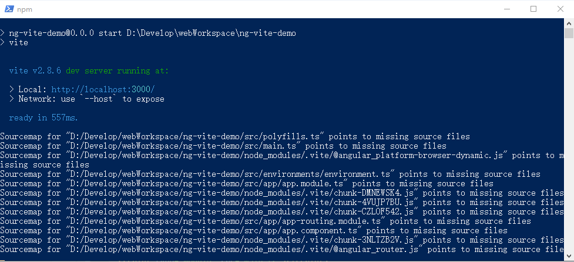

# NgViteDemo

项目使用 `angular` 13.1.2 和`vite` 2.8.6开发

## 启动服务

开发模式运行 `npm start`, 然后打开浏览器, 输入地址 `http://localhost:3000/`, 应用将自动加载.

## 运行效果



## 注意事项

通过添加依赖`@nxext/angular`和`vite`来集成开发.

- vite配置文件为`vite.config.ts`

- 修改 `src/index.html` 文件, 添加代码如下:

``` html
<script type="module" src="./polyfills.ts"></script>
<script type="module" src="main.ts"></script>
```

- 修改 `HTML` 代码浏览器不会刷新,还需要修改ts代码才能自动刷新
